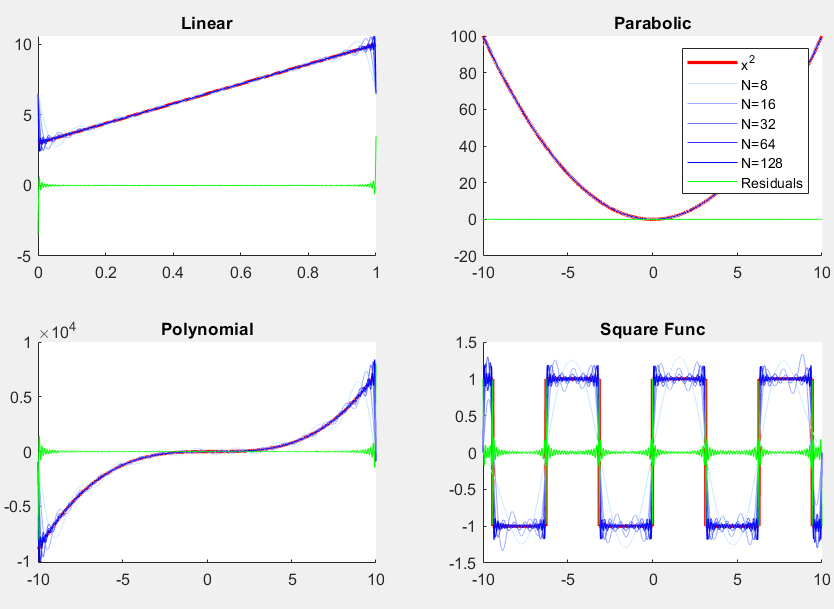

# Heston & Fourier

## Gemini
This repo's main item is gemini.m , a UI that allows you high level of parameter customisation, or automate a slider to view effect over time.

Still a work in progress, in future I will add:
- (T) Expiry timeframe slider
- (S0) Spot/Initial Price
- Monte-carlo simulation option visualiser

## Timings

Program runs a euler-maryuma process for St and ln(St), as well as using milstein corrections for both.
Then compares price and timings for different grid sizes for the discretisations in a final output table.

Todo:
- add Fourier price

## realFourier

Plots a function, and overplots the fourier series estimation at different iteration levels. 
And again overplotted with the error of the estimation.

